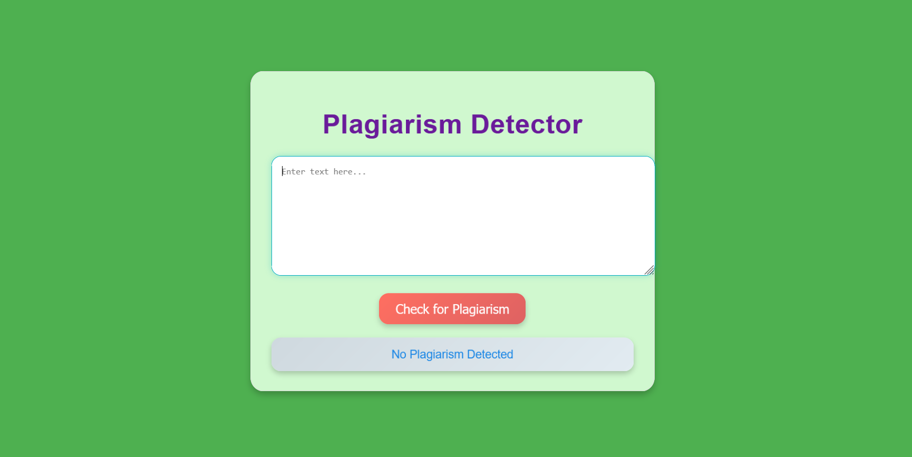
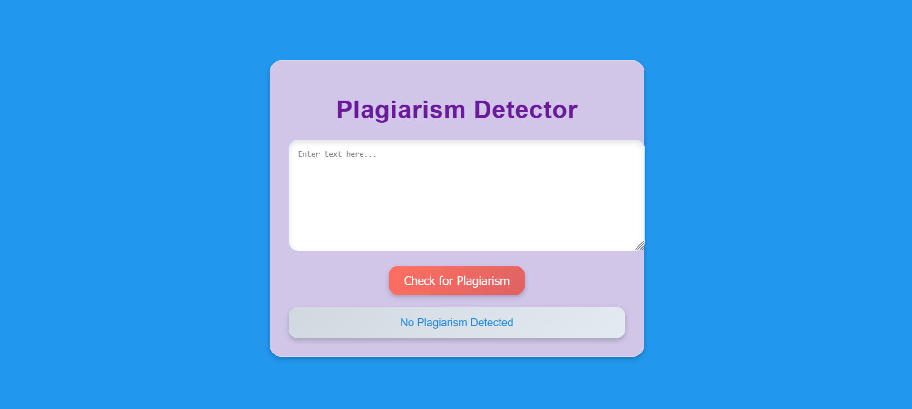
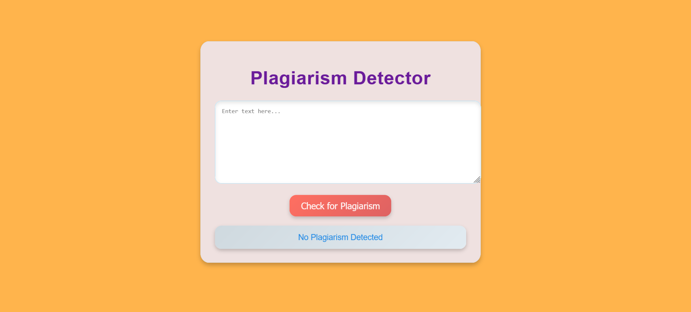
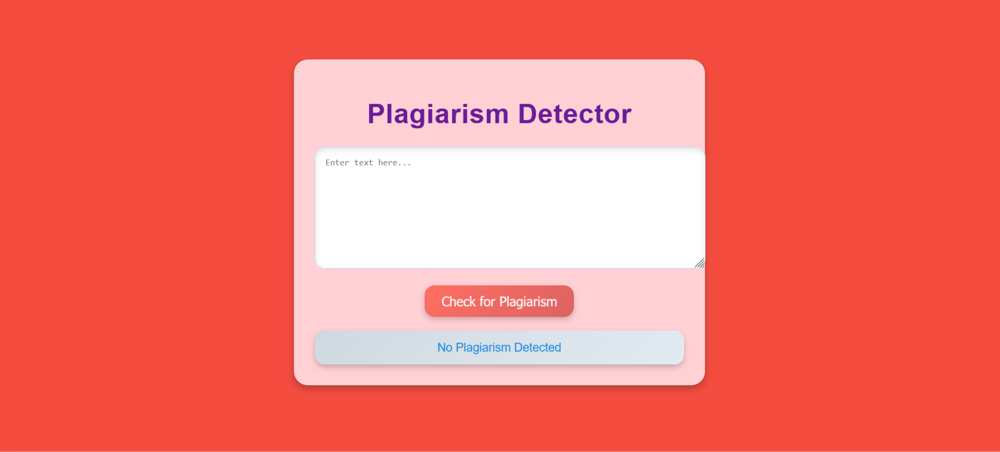

# Plagiarism-detector-using-machine-learning

# Introduction

Plagiarism detection is a crucial task in educational and professional settings. By leveraging machine learning techniques, we can create a robust plagiarism detector that can accurately identify copied content. This blog post walks you through the process of building a plagiarism detector from collecting the dataset to creating a Flask web application for easy use.

# Collecting the Dataset

The first step in building our plagiarism detector is gathering a comprehensive dataset. The dataset should consist of text documents that contain both original and plagiarized content. You can find such datasets from online sources like Kaggle or create your own by manually collecting documents.

Here, we use a hypothetical dataset containing pairs of text where each pair includes one original document and one plagiarized version. This dataset will help train our machine learning model to distinguish between original and copied content.

# Preprocessing the Data

Before feeding the data into our machine learning model, we need to preprocess it. Preprocessing steps include:

Tokenization: Splitting the text into individual words or tokens.

Lowercasing: Converting all text to lowercase to ensure uniformity.

Removing Punctuation: Eliminating punctuation marks to avoid treating them as words.

Stopwords Removal: Removing common words like "and", "the", etc., that do not contribute to the meaning of the text.

# Building the Machine Learning Model

We use the Term Frequency-Inverse Document Frequency (TF-IDF) vectorizer to transform the text data into numerical features. Then, we train a model using these features. For this example, we will use a simple logistic regression model.

# Creating the Flask Web Application

To make our plagiarism detector easily accessible, we create a Flask web application. This application will provide a user interface where users can input two text documents and receive a plagiarism score.

